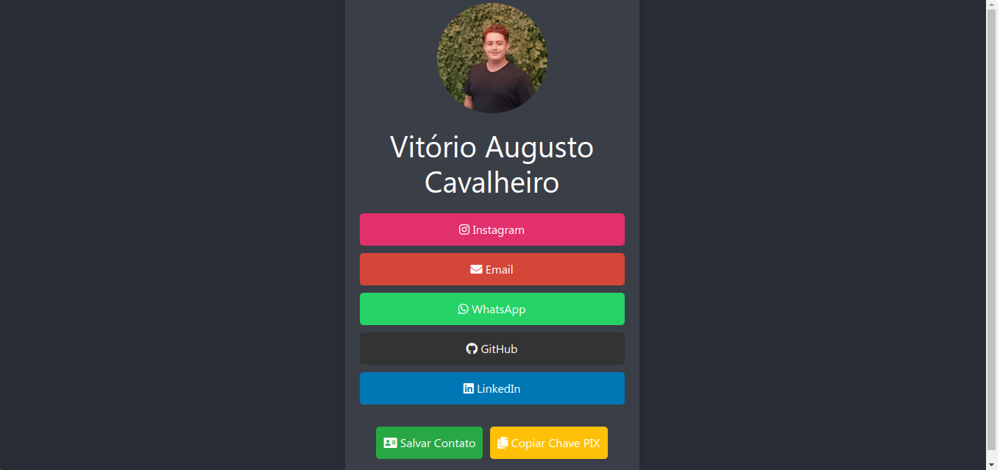

<p align="center">
 <a href="#-about-the-project">About</a> •
 <a href="#-features">Features</a> •
 <a href="#-layout">Layout</a> • 
 <a href="#-how-to-run-the-project">How to Run</a> • 
 <a href="#-technologies">Technologies</a> • 
 <a href="#-how-to-contribute-to-the-project">Contribute</a> • 
 <a href="#-license">License</a> • 
 <a href="#-contributors">Contributors</a>
</p>

## 💻 About the project

This project is a professional profile web application inspired by Linktree, designed specifically for Instagram profiles. It allows users to create a clean and organized landing page with links to their professional portfolio, social media accounts, and other relevant resources.

Feel free to use this project for personal use!

---

## ⚙️ Features

- 🌟 **Professional Profiles:** Users can create profiles that highlight their skills, experience, and portfolio.
- 🔗 **Social Media Integration:** Easily link to other social media platforms.
- 📱 **Responsive Design:** Fully responsive layouts built with Bootstrap to ensure profiles look great on any device.

## 🎨 Layout

The project features a minimalist and modern design, ensuring that your profile looks professional and inviting. It utilizes Bootstrap for responsive design and consistent styling.



---

## 🚀 How to run the project

1. **Clone the repository:**
   ```bash
   git clone https://github.com/yourusername/yourprojectname.git
   ```

2. **Navigate to the project directory:**
   ```bash
   cd yourprojectname
   ```

3. **Create a virtual environment:**
   ```bash
   python3 -m venv venv
   ```

4. **Activate the virtual environment:**
   - On Windows:
     ```bash
     venv\Scripts\activate
     ```
   - On macOS/Linux:
     ```bash
     source venv/bin/activate
     ```

5. **Install dependencies:**
   ```bash
   pip install -r requirements.txt
   ```

6. **Run the Flask application:**
   ```bash
   flask run
   ```

7. **Access the application:**
   Open your browser and go to `http://127.0.0.1:5000`.

---

## 🛠 Technologies

- **HTML5**: For creating the structure of the web pages.
- **CSS3**: For styling and visual presentation.
- **Bootstrap**: For responsive layout and pre-built components.
- **Flask (Python)**: As the web framework to manage back-end operations.

---

## ✨ Contribution

Help the community make this project even more amazing. Read how to contribute by clicking **[here](https://github.com/yourusername/yourprojectname/blob/main/CONTRIBUTING.md)**. Together, we can achieve incredible things!

---

## 📝 License

This project is licensed under the [MIT License](./LICENSE).

---

## 👨‍💻 Contributors

💜 A big thanks 👏 to these folks who brought this project from the realm of ideas to execution!

<table>
  <tr>
    <td align="center"><a href="https://github.com/oVitorio"><br /><sub><b>Vitório Cavaleheiro</b></sub></a><br /><a href="https://github.com/oVitorio" title="github-oVitorio">👨‍🚀</a>
    </td> 
  </tr>
</table>

---